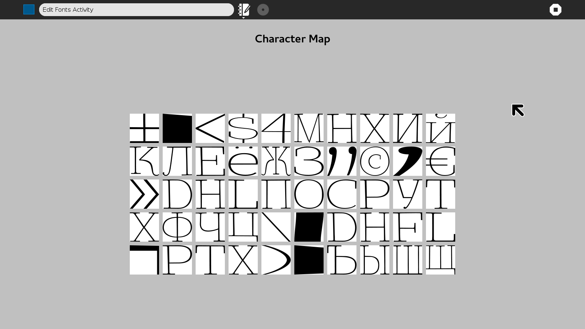

# Edit Fonts UI Mock-up
A UI mock-up built with GTK, for GSoC16 project: https://github.com/sugarlabs/edit-fonts-activity

##New Features
* Normalised the glyph drawing code
* Made a renderGlyph Class for drawing the glyph inside a specified box size
* Made a glyphGridInstance Class for drawing a grid of glyph from a given list

here is a screenshot
 
