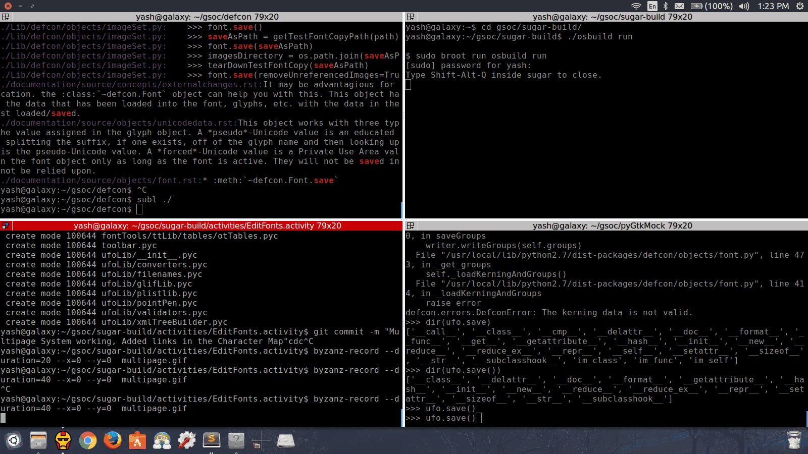

# Edit Fonts Activity  [](https://travis-ci.org/sugarlabs/edit-fonts-activity)

A font editor Activity, for GSoC16 project: https://github.com/sugarlabs/edit-fonts-activity

##New Features

* Normalised the glyph drawing code
* Made a renderGlyph Class for drawing the glyph inside a specified box size
* Made a glyphGridInstance Class for drawing a grid of glyph from a given list
* Glyph aspect ratio problem solved
* Character Map class added
* Font Info Box added 
* Multipage System
* Export/Import Buttons (NOT WORKING)

Here is a gif showing all the features


## The Import/Export Buttons

I'm having the following problems with it

```python
    def _load_otf(self, button):
        ##NOT WORKING##
        ##unable to access the path##

        path = "NotoSerif-Regular.ttf"
        file_name = os.path.join(self.get_activity_root(),
                                 path)

        extractor.extractUFO(file_name, self.main_font)

    def _write_ttf(self, button):
        ##NOT WORKING##
        ##Error: defcon.errors.DefconError: the kerning data is not valid##

        file_name = os.path.join(self.get_activity_root(), 'instance',
                                 '%s.ttf' % self.metadata['title'])

        #file_name = self.metadata['title'] + '.ttf' 

        ttf = compileTTF(self.main_font)
        ttf.save(file_name)
        
        jobject = datastore.create()
        jobject.metadata['icon-color'] = profile.get_color().to_string()
        jobject.metadata['mime_type'] = 'application/ttf'

        jobject.metadata['title'] = self.metadata['title']
        jobject.file_path = file_name

        # jobject.metadata['preview'] = \
        #    self._get_preview_image(file_name)

        datastore.write(jobject, transfer_ownership=True)
        self._object_id = jobject.object_id

        self._show_journal_alert(_('Success'),
                                 _('A TTF Font file was created in the Journal'))

    def _write_ufo(self, button):
        ##NOT WORKING##
        ##Error: defcon.errors.DefconError: the kerning data is not valid##

        file_name = os.path.join(self.get_activity_root(), 'instance',
                                 '%s.ufo' % self.metadata['title'])

        #file_name = self.metadata['title'] + '.ttf' 
        self.main_font.save(file_name)

        jobject = datastore.create()
        jobject.metadata['icon-color'] = profile.get_color().to_string()
        jobject.metadata['mime_type'] = 'application/ufo'

        jobject.metadata['title'] = self.metadata['title']
        jobject.file_path = file_name

        # jobject.metadata['preview'] = \
        #    self._get_preview_image(file_name)

        datastore.write(jobject, transfer_ownership=True)
        self._object_id = jobject.object_id

        self._show_journal_alert(_('Success'),
                                 _('A UFO Font file was created in the Journal'))

    def _write_otf(self, button):
        ##NOT WORKING##
        ##Error: defcon.errors.DefconError: the kerning data is not valid##

        file_name = os.path.join(self.get_activity_root(), 'instance',
                                 '%s.otf' % self.metadata['title'])

        otf = compileTTF(self.main_font)
        otf.save(file_name)
        
        jobject = datastore.create()
        jobject.metadata['icon-color'] = profile.get_color().to_string()
        jobject.metadata['mime_type'] = 'application/otf'

        jobject.metadata['title'] = self.metadata['title']
        jobject.file_path = file_name

        datastore.write(jobject, transfer_ownership=True)
        self._object_id = jobject.object_id

        self._show_journal_alert(_('Success'),
                                 _('A OTF Font file was created in the Journal'))

```
I think defcon deletes the duplicate kearnings when loading the font, but this gives an error on exporting the font.

