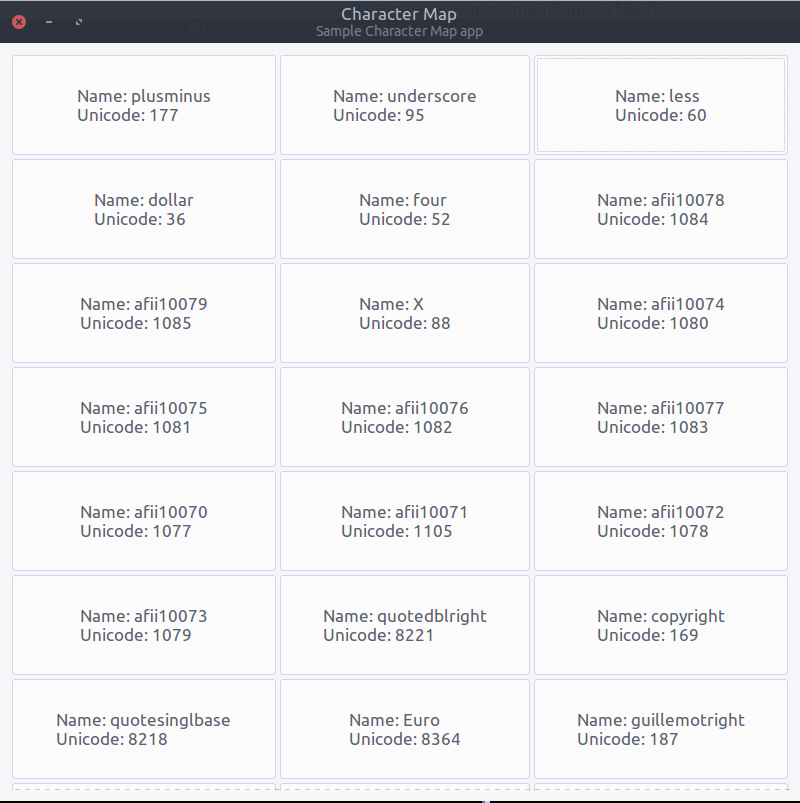

# Python-GTK-Mock
This is a try at making the Python/GTK Mock for my GSoC 2016 under Sugar Labs

This is a Work In Progress: 

1. The `main.py` file only shows the number of glyphs in the font and then traverses the font to display all the glyph names
2. The `guiTry.py` shows the same info as the `main.py` in a GTK grid layout 

Here is a screenshot:

