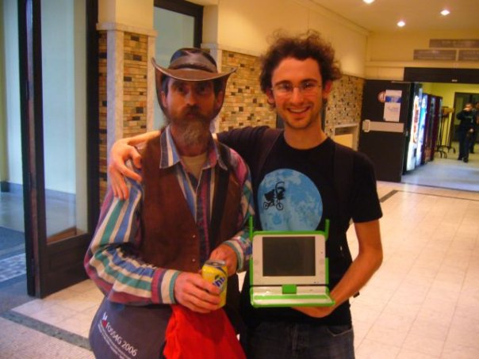

_February 28, 2007, Rob Savoye, holding his XO-B1 laptop (one of the 400 prototypes made at the time) with Dave Crossland in Brussels at the FOSDEM._

# Profile: Dave Crossland

Computers were irresistible to me, growing up in the suburban arcadia of south west England in the 1990s. 
But being “good with computers” pointed towards the life of corporate office doom, so in high school I dropped maths and physics for contemporary art and socio-linguistics.

Combining my interests in art and computers eventually led me to the BA Interaction Design programme at Ravensbourne College in London. By the time I graduated in 2006, I was fascinated with the potential of software freedom for graphic design and typography. I decided to free fonts.

I attended the University of Reading’s MA Typeface Design programme and graduated in 2009. In my [dissertation](https://github.com/davelab6/matd-dissertation/) I related the history of the software freedom movement to key concepts in type design. My student project [Cantarell](https://en.wikipedia.org/wiki/Cantarell_(typeface)) was included in the launch of [Google Fonts](https://www.google.com/fonts) and chosen as the default User Interface font for [GNOME v3](https://www.gnome.org).

In 2016 I am living in New York City, consulting for the Google Fonts project, participating in the [Sugar Labs](https://www.sugarlabs.org) project, and offering workshops on typeface design with free software with [Crafting Type](http://craftingtype.com).
