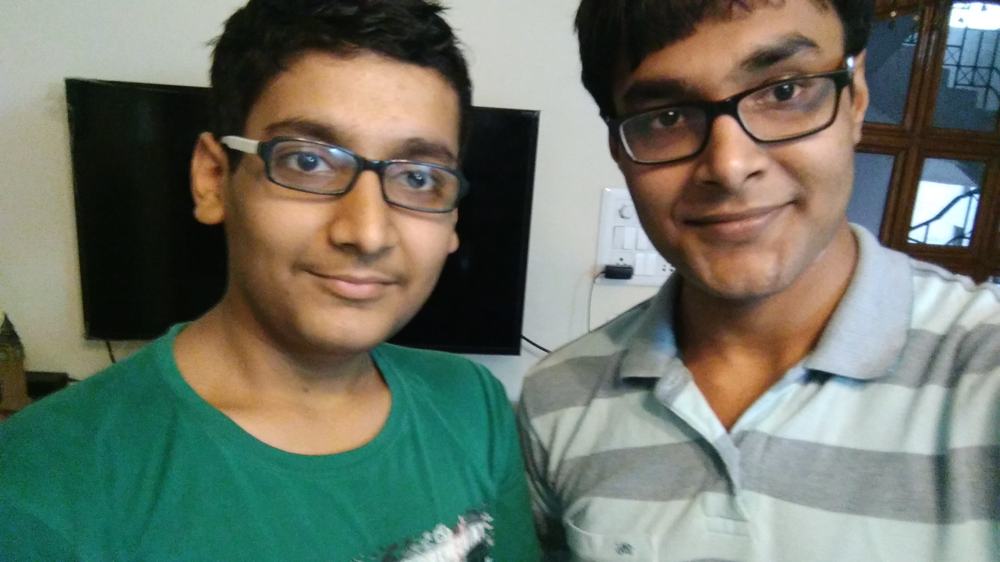

# Profile: Eli Heuer

I started my career as a UI and type designer working in the game industry. We regularly needed to add missing glyphs and alternate styles to our internal bitmap font collection and I would usually take on those projects. I've been hooked on designing typefaces ever since, I find it to be an extremely enjoyable activity. 

I left the game industry for a short career as a bike messenger and delivery cyclist, this allowed me to do design work I found interesting like creating fliers and imagery for my musician friends in the Seattle independent music scene. My time spent as a scrappy part-time freelancer brought me to be interested in free software and libre-fonts. I wanted to do cutting edge design work on old e-waste computers using only free software.

Without enrolling I just started showing up at every event I could at the University of Washington visual communication department. Here I was given a USB thumb drive that contained a massive collection of high-quality typefaces with wonderful OpenType features I hadn't seen before with my previous collection of pirated fonts I had downloaded through BitTorrent. 

Working as a bike messenger eventually brought me to NYC where I did freelance graphic design for [fashion designers](https://vimeo.com/120125747) and started taking evening classes in type design at the Cooper Union. [That year student protesters occupied the president's office demanding free tuition](https://en.wikipedia.org/wiki/Cooper_Union_financial_crisis_and_tuition_protests). Peter Cooper started the school in 1859 with the explicit intention of providing free education to working class New Yorkers, but the school had recently started charging undergraduate tuition and offering paid night classes. I become enamored with Peeter Cooper's ideas and wanted to do my part to update them for the 21st century. This search for ways to provide free, high-quality education for everyone furthered my interest in free software.

In 2015, I attended the Libre Graphics Meeting in Toronto where I briefly meet Dave but spent lots of time talking to Peter Sikking who was working on the Metapolator project. In early 2016 I was doing animation with Python and DrawBot and connected with dave over Twitter and eventually got involved with building this font editor. 

I have a type specimen of all the libre-typefaces I have designed [here](https://github.com/eliheuer/type-specimens/blob/master/Eli_Heuer_Type_Specimen.pdf). most of these typefaces are avaiable on [my github page](https://github.com/eliheuer).  

I'm looking forward getting more involved with free software in the future and I'm fascinated by the ways open-source in general is reshaping the global economy. 
